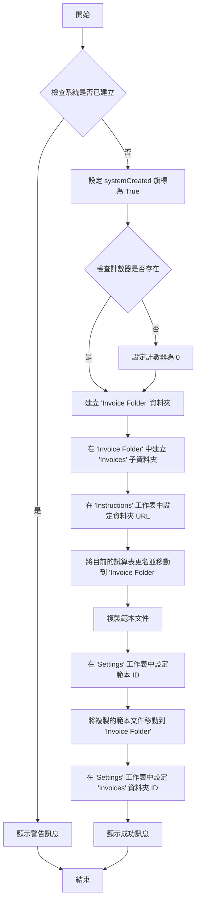
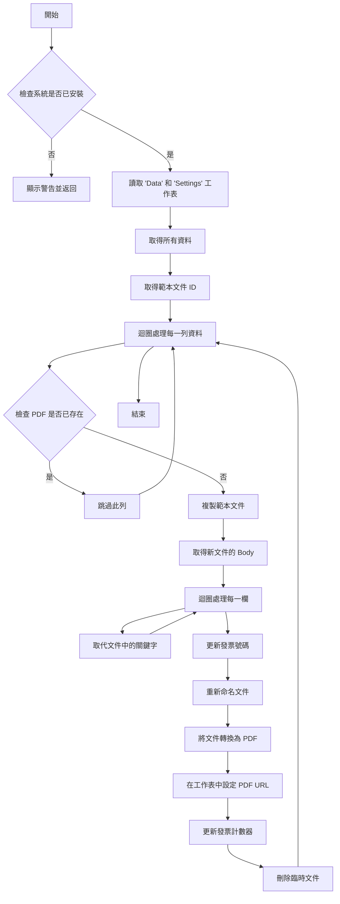
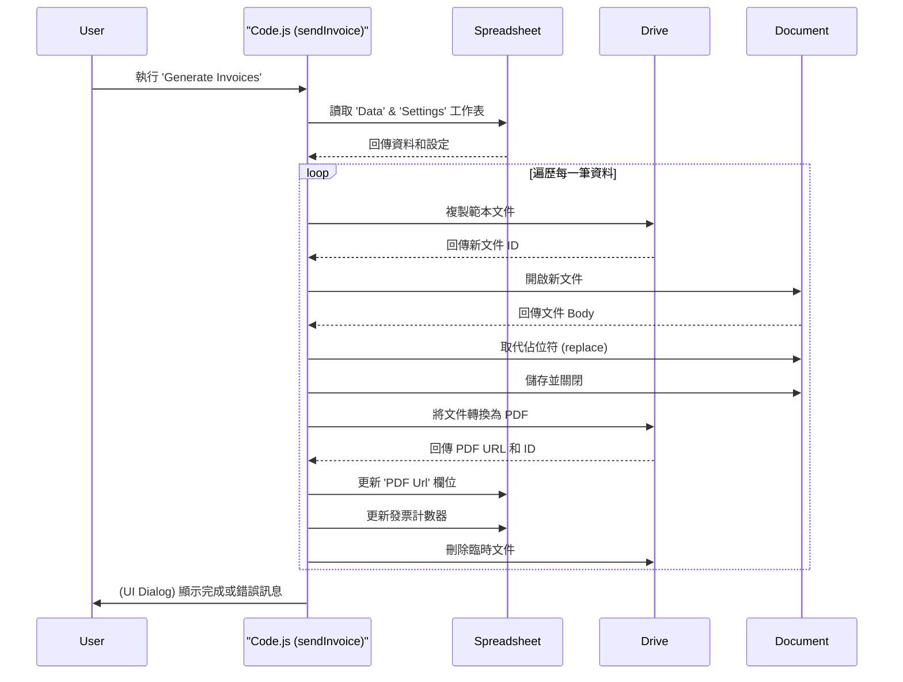
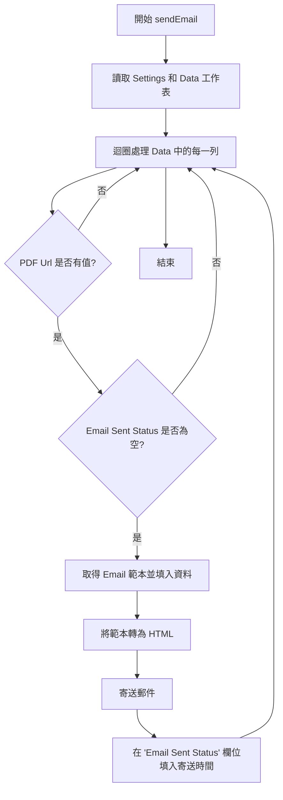

# Invoice Generator - 規格文件

這份文件詳細分析了 `Code.js` 這個 Google Apps Script 的功能、架構和實作細節。

## 1. 總體架構分析

此指令稿的目的是自動化發票產生流程。它讀取 Google Sheets 中的資料，使用 Google Docs 範本來填入資料，最後產生 PDF 格式的發票，並將連結存回 Google Sheets。

### 核心元件

*   **Google Sheet (試算表)**: 作為資料來源和控制面板。
    *   `Data` 工作表: 包含要填入發票的客戶和項目資料。
    *   `Settings` 工作表: 儲存系統設定，如範本 ID、資料夾 ID 和發票計數器。
    *   `Instructions` 工作表: 提供使用者操作說明。
*   **Google Doc (文件)**: 作為發票的範本。文件中的佔位符 (例如 `%client_name%`) 會被試算表中的資料取代。
*   **Google Drive (雲端硬碟)**: 用於儲存產生的 PDF 發票和相關檔案。
*   **Apps Script (`Code.js`)**: 核心邏輯所在，負責協調上述所有元件，執行發票產生流程。

### 互動流程

1.  **安裝 (`createSystem`)**: 使用者首次執行時，指令稿會在 Google Drive 中建立必要的資料夾結構 (`Invoice Folder`, `Invoices`)，複製範本文件，並在 `Settings` 工作表中記錄相關 ID。
2.  **產生發票 (`sendInvoice`)**: 使用者觸發此功能後，指令稿會：
    a. 讀取 `Data` 工作表中的每一行資料。
    b. 對於尚未產生 PDF 的資料行，複製 Google Doc 範本。
    c. 將該行資料填入新複製的文件中，取代對應的佔位符。
    d. 將填好資料的文件轉換為 PDF，並儲存到 `Invoices` 資料夾。
    e. 將產生的 PDF 檔案連結寫回 `Data` 工作表的對應行。
    f. 刪除過程中產生的臨時 Google Doc 文件。

### `createSystem()` 函式流程圖

### `sendInvoice()` 函式流程圖

## 2. 設定 (`SETTINGS`) 詳解

[`SETTINGS`](Code.js:21) 物件包含了指令稿運作所需的各種靜態設定。

*   `sheetName`: (`"Data"`) - 儲存發票資料的工作表名稱。
*   `documentUrl`: (`null`) - (未使用) 預期可能用於儲存文件 URL。
*   `templateUrl`: (`'14oTfL_zUbBdRD4VXY8U0NAJjQ4cKNxHGBax-bfH5NDs'`) - 預設的 Google Doc 範本文件 ID。
*   `spreadsheetName`: (`'Invoice data'`) - 執行 `createSystem` 後，試算表會被重新命名的名稱。
*   `documentName`: (`'Invoice Template'`) - 執行 `createSystem` 後，範本文件會被複製並重新命名的名稱。
*   `sheetSettings`: (`"Settings"`) - 儲存系統設定的工作表名稱。
*   `col`: (物件) - 定義了在 `Settings` 工作表中，各項設定值所在的儲存格位置。
    *   `templateId`: (`"B1"`) - 儲存發票範本文件 ID 的儲存格。
    *   `count`: (`"B2"`) - 儲存發票流水號計數器的儲存格。
    *   `folderId`: (`"B3"`) - 儲存產生的 PDF 發票存放資料夾 ID 的儲存格。
    *   `systemCreated`: (`"B4"`) - 標記 `createSystem` 是否已執行過的旗標儲存格。

## 3. 函式功能文件化

### `onOpen()`
*   **目的**: 當使用者打開試算表時，在 UI 中建立一個自訂選單 "Invoice Generator"。
*   **觸發方式**: Google Sheets 的 `onOpen` 簡易觸發器。

### `createSystem()`
*   **目的**: 初始化整個發票產生系統的環境。
*   **關鍵步驟**:
    1.  檢查系統是否已經被建立過，避免重複執行。
    2.  在 Google Drive 中建立 `Invoice Folder` 和 `Invoices` 子資料夾。
    3.  將目前的試算表和範本文件複製並移動到 `Invoice Folder` 中。
    4.  將新建立的資料夾 ID 和文件 ID 記錄到 `Settings` 工作表中。

### `sendInvoice()`
*   **目的**: 根據 `Data` 工作表的資料產生所有發票。
*   **關鍵步驟**:
    1.  檢查 `createSystem` 是否已執行。
    2.  讀取 `Data` 工作表的所有資料。
    3.  遍歷每一行資料，如果該行的 "PDF Url" 欄位為空，則執行發票產生。
    4.  複製範本文件。
    5.  將該行資料逐一取代範本中的佔位符 (e.g., `%key%`)。
    6.  處理特殊格式，如日期和貨幣。
    7.  產生並格式化發票流水號。
    8.  將填好資料的文件另存為 PDF 到 `Invoices` 資料夾。
    9.  將 PDF 的 URL 寫回 `Data` 工作表的 "PDF Url" 欄。
    10. 更新 `Settings` 中的發票計數器。
    11. 刪除過程中產生的臨時 Google Doc 文件。

### `convertPDF(id)`
*   **目的**: 將指定的 Google Doc 文件轉換為 PDF 檔案。
*   **參數**: `id` (String) - Google Doc 文件的 ID。
*   **回傳**: `[url, id]` (Array) - 包含新產生的 PDF 檔案的 URL 和 ID。

### `moveFile(file, dest_folder)`
*   **目的**: 將一個檔案或資料夾從一個位置移動到另一個 Google Drive 資料夾。
*   **參數**:
    *   `file` (Object) - 要移動的檔案/資料夾物件。
    *   `dest_folder` (Object) - 目標資料夾物件。

### `replace(key, text, body)`
*   **目的**: 在 Google Doc 的內文中尋找並取代文字。
*   **參數**:
    *   `key` (String) - 要被取代的文字 (佔位符)。
    *   `text` (String) - 要插入的新文字。
    *   `body` (Body) - 文件的 Body 物件。

## 4. 資料流說明

以下序列圖展示了 `sendInvoice` 函式執行期間，各個元件之間的資料互動流程。

## 5. 相依性分析

此指令稿依賴以下 Google Workspace 服務：

*   **Spreadsheet Service (`SpreadsheetApp`)**: 用於讀取、寫入和操作 Google Sheets。
*   **Drive Service (`DriveApp`)**: 用於管理 Google Drive 中的檔案和資料夾（建立、移動、刪除）。
*   **Document Service (`DocumentApp`)**: 用於開啟、編輯和操作 Google Docs 內容。
*   **HTML Service (`HtmlService`)**: 用於建立簡單的 HTML 使用者介面 (對話方塊)。
*   **Advanced Drive Service (`Drive`)**: 使用進階 API (`Drive.Files.remove`) 來刪除檔案，需要在使用前在專案中啟用。
## 6. 新增功能規劃：郵件寄送

根據最新需求，系統將新增獨立的郵件寄送功能，並對現有功能進行重構，以提高模組化和可維護性。

### 6.1. 現有功能重構

*   **函式更名**: 為了更精確地反映其功能，`sendInvoice()` 函式將更名為 `generateInvoice()`。此函式專注於產生 PDF 發票。
*   **UI 選單更新**: `onOpen()` 中的 "Generate Invoices" 選單項目將對應到新的 `generateInvoice()` 函式。

### 6.2. 新增 `sendEmail()` 功能

此功能將獨立於 PDF 產生，專門負責郵件的寄送。

#### 資料表設定

*   **`Settings` 工作表**:
    *   新增 `Email Template URL` 欄位：用於存放郵件範本的 Google Doc 網址。
    *   新增 `Email Subject` 欄位：用於設定郵件主旨。
    *   新增 `收件人欄位名稱` 欄位：用於指定 `Data` 工作表中哪一欄是收件人的 Email 地址。
*   **`Data` 工作表**:
    *   新增 `Email Sent Status` 欄位：用於記錄郵件寄送狀態（成功寄送後填入寄送時間）。
    *   新增 `客戶信箱` 欄位（或由 `收件人欄位名稱` 指定的欄位）：存放收件人 Email。

#### 核心邏輯

1.  **觸發條件**: 使用者透過 UI 選單中的 "Send Emails" 觸發 `sendEmail()` 函式。
2.  **執行條件**: 函式會遍歷 `Data` 工作表，只有當一筆資料同時滿足以下兩個條件時，才會執行郵件寄送：
    *   該行的 `PDF Url` 欄位 **有值**。
    *   該行的 `Email Sent Status` 欄位 **為空**。
3.  **郵件產生**:
    *   使用 `Settings` 中指定的 `Email Template URL` 複製一份臨時 Google Doc。
    *   將資料填入臨時文件。
    *   透過 `getHtmlFromDoc()` 輔助函式將文件內容轉換為 HTML。
4.  **郵件寄送**:
    *   使用 `MailApp.sendEmail()` 服務寄送郵件。
    *   成功後，在 `Email Sent Status` 欄位填入當前的日期與時間。

#### `sendEmail()` 函式流程圖

