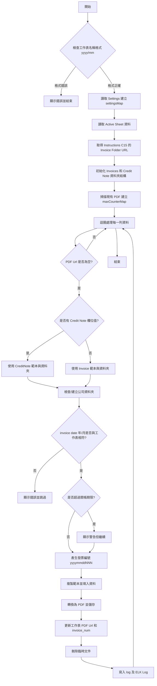
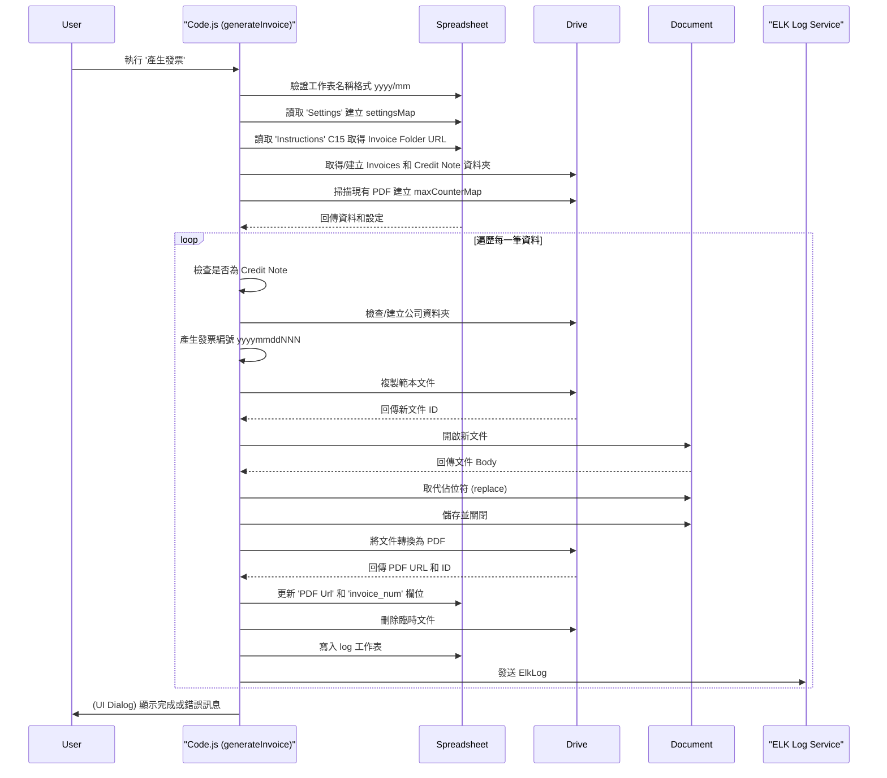
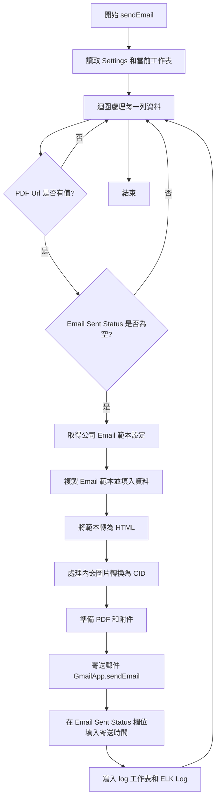

# Invoice Generator - 規格文件

這份文件詳細分析了 `Code.js` 這個 Google Apps Script 的功能、架構和實作細節。

## 版本歷程

| 版本 | 說明 |
|------|------|
| 1.0.0 | Initial release |
| 1.1.0 | Auto configuration |
| 1.2.0 | 修改規格可以支援多個樣版，settings修改規格 |
| 1.3.0 | 新增寄信功能可以使用 Google Doc 做 HTML 樣版 |
| 1.4.0 | 修正發票號碼改以「公司名稱」目錄下檔案，而不是 Invoice Folder 全部檔案 |
| 1.4.1 | 修正 log: "app" → "App" |
| 1.4.2 | 補上 log 缺少欄位，新增 "invoice_num" 欄位 |
| 1.4.3 | 檢查開立發票時，工作表名稱 `yyyy/mm` 格式，且目前時間大於工作表名稱指定的年/月時顯示「關帳期限」警告 |
| 1.4.4 | 增加 Credit Note 填入需作廢或折讓的 Invoice_num，需在 Settings 設定「CreditNote URL」樣版 |
| 1.4.5 | 超過「關帳期限」改為「警告」不再禁止 |
| 1.4.6 | 修正寄信錯誤，因應 sheet 名稱變更 |

## 1. 總體架構分析

此指令稿的目的是自動化發票產生流程。它讀取 Google Sheets 中的資料，使用 Google Docs 範本來填入資料，最後產生 PDF 格式的發票，並將連結存回 Google Sheets。

### 核心元件

*   **Google Sheet (試算表)**: 作為資料來源和控制面板。
    *   `yyyy/mm` 工作表 (如 `2025/07`): 包含要填入發票的客戶和項目資料。
    *   `Settings` 工作表: 儲存多公司設定，包含範本 URL、資料夾 URL 和 Credit Note 相關設定。
    *   `Instructions` 工作表: 提供使用者操作說明，`C15` 儲存 Invoice Folder URL。
    *   `log` 工作表: 自動產生，記錄所有發票產生與郵件寄送的操作日誌。
*   **Google Doc (文件)**: 作為發票的範本。文件中的佔位符 (例如 `%client_name%`) 會被試算表中的資料取代。
*   **Google Drive (雲端硬碟)**: 用於儲存產生的 PDF 發票和相關檔案，包含 `Invoices` 和 `Credit Note` 子目錄。
*   **Apps Script (`Code.js`)**: 核心邏輯所在，負責協調上述所有元件，執行發票產生流程。
*   **ELK Log 服務**: 透過 `ElkLog()` 函式將操作日誌發送至外部 ELK 系統。

### 互動流程

1.  **安裝 (`createSystem`)**: 使用者首次執行時，指令稿會在 Google Drive 中建立必要的資料夾結構 (`Invoice Folder`, `Invoices`)，並在 `Instructions` 工作表 C15 記錄資料夾 URL。
2.  **產生發票 (`generateInvoice`)**: 使用者觸發此功能後，指令稿會：
    a. 讀取當前 active 工作表（名稱必須為 `yyyy/mm` 格式）中的每一行資料。
    b. 根據「公司名稱」欄位，從 `Settings` 工作表查詢對應的範本和資料夾設定。
    c. 對於尚未產生 PDF 的資料行，複製對應公司的 Google Doc 範本。
    d. 將該行資料填入新複製的文件中，取代對應的佔位符。
    e. 產生發票編號（格式：`yyyymmddNNN`）。
    f. 將填好資料的文件轉換為 PDF，並儲存到對應公司的資料夾。
    g. 將產生的 PDF 檔案連結和發票編號寫回工作表的對應行。
    h. 刪除過程中產生的臨時 Google Doc 文件。
    i. 寫入 `log` 工作表並發送 ELK Log。
3.  **寄送郵件 (`sendEmail`)**: 獨立功能，遍歷資料，對已產生 PDF 但尚未寄送的項目發送郵件。

### 資料夾結構

```
Invoice Folder/
├── Invoices/
│   ├── 公司A/
│   │   ├── 客戶平台 20250701001.pdf
│   │   └── 客戶平台 20250702001.pdf
│   └── 公司B/
│       └── ...
└── Credit Note/
    ├── 公司A/
    │   └── ...
    └── 公司B/
        └── ...
```

### `generateInvoice()` 函式流程圖


```mermaid
graph TD
    A[開始] --> B{檢查工作表名稱格式 yyyy/mm};
    B -->|格式錯誤| C[顯示錯誤並結束];
    B -->|格式正確| D[讀取 Settings 建立 settingsMap];
    D --> E[讀取 Active Sheet 資料];
    E --> F[取得 Instructions C15 的 Invoice Folder URL];
    F --> G[初始化 Invoices 和 Credit Note 資料夾結構];
    G --> H[掃描現有 PDF 建立 maxCounterMap];
    H --> I[迴圈處理每一列資料];
    I --> J{PDF Url 是否為空?};
    J -->|否| I;
    J -->|是| K{是否有 Credit Note 欄位值?};
    K -->|是| L[使用 CreditNote 範本與資料夾];
    K -->|否| M[使用 Invoice 範本與資料夾];
    L --> N[檢查/建立公司資料夾];
    M --> N;
    N --> O{invoice date 年/月是否與工作表相符?};
    O -->|否| P[顯示錯誤並跳過];
    O -->|是| Q{是否超過關帳期限?};
    Q -->|是| R[顯示警告但繼續];
    Q -->|否| S[產生發票編號 yyyymmddNNN];
    R --> S;
    S --> T[複製範本並填入資料];
    T --> U[轉換為 PDF 並儲存];
    U --> V[更新工作表 PDF Url 和 invoice_num];
    V --> W[刪除臨時文件];
    W --> X[寫入 log 及 ELK Log];
    X --> I;
    I --> Y[結束];
```

## 2. 設定 (`SETTINGS`) 詳解

`SETTINGS` 物件包含了指令稿運作所需的各種靜態設定。

| 屬性 | 值 | 說明 |
|------|------|------|
| `sheetName` | `"Data"` | (已停用) 原資料工作表名稱 |
| `documentUrl` | `null` | (未使用) |
| `spreadsheetName` | `'Invoice data'` | 試算表重新命名的名稱 |
| `documentName` | `'Invoice Template'` | 範本文件重新命名的名稱 |
| `pdfColName` | `'PDF Url'` | 儲存 PDF 連結的欄位名稱 |
| `pdfFileHead` | `'客戶平台'` | PDF 檔名前綴來源欄位 |
| `attFileColName` | `'Attachment Url'` | 額外附件欄位名稱 |
| `emailRecipientColName` | `'client_email'` | 收件人 Email 欄位名稱 |
| `emailSubjectColName` | `'email_subject'` | 郵件主旨欄位名稱 |
| `sheetSettings` | `"Settings"` | 設定工作表名稱 |

### Settings 工作表欄位結構

| 欄位名稱 | 說明 |
|----------|------|
| `公司名稱` | 公司識別名稱（與 Data 工作表對應） |
| `Template URL` | Invoice Google Doc 範本網址 |
| `Folder URL` | Invoice PDF 儲存資料夾網址（自動產生） |
| `CreditNote URL` | Credit Note Google Doc 範本網址 |
| `CreditNote Folder URL` | Credit Note PDF 儲存資料夾網址（自動產生） |
| `Email Template URL` | 郵件 HTML 範本 Google Doc 網址 |
| `email_subject` | 郵件主旨（支援 `%key%` 佔位符） |

### Data 工作表必要欄位

| 欄位名稱 | 說明 |
|----------|------|
| `公司名稱` | 對應 Settings 的公司設定 |
| `invoice date` | 發票日期（用於產生發票編號） |
| `invoice_num` | 發票編號（自動產生） |
| `PDF Url` | 產生的 PDF 連結（自動填入） |
| `client_email` | 收件人 Email（支援多位，以逗號或分號分隔） |
| `Email Sent Status` | 郵件寄送時間（自動填入） |
| `Credit Note` | 填入需作廢或折讓的原 Invoice 編號 |
| `客戶平台` | PDF 檔名前綴 |

## 3. 函式功能文件化

### `onOpen()`
*   **目的**: 當使用者打開試算表時，在 UI 中建立一個自訂選單 "Invoice Generator"。
*   **選單項目**:
    *   「產生發票」→ `generateInvoice()`
    *   「Send Emails」→ `sendEmail()`
    *   「產生並寄送發票」→ `generateAndSendInvoice()`

### `ElkLog(msg)`
*   **目的**: 將操作日誌發送至外部 ELK 系統。
*   **參數**: `msg` (Object) - 包含日誌資料的物件。
*   **處理**:
    *   自動加入 `App`、`Domain`、`UserName` 欄位。
    *   自動將包含 `date` 的欄位轉換為 ISO 8601 格式。

### `createSystem()` [DEPRECATED]
*   **目的**: 初始化整個發票產生系統的環境。
*   **狀態**: 已棄用，新的多公司架構需手動設定。
*   **新增公司步驟**:
    1. 手動建立公司的 Invoice 資料夾。
    2. 手動建立公司的 Google Doc 範本。
    3. 在 `Settings` 工作表新增一列，填入公司名稱、Template URL、Folder URL。

### `generateInvoice(bShowDialog = true)`
*   **目的**: 根據當前 active 工作表的資料產生所有發票。
*   **關鍵特性**:
    *   工作表名稱必須為 `yyyy/mm` 格式。
    *   支援多公司架構，依「公司名稱」欄位查詢對應設定。
    *   支援 Credit Note 產生（當 `Credit Note` 欄位有值時）。
    *   發票編號格式：`yyyymmddNNN`（日期 + 3 位流水號）。
    *   自動檢查 invoice date 年/月是否與工作表名稱相符。
    *   超過關帳期限時顯示警告但不阻止。

### `generateAndSendInvoice()`
*   **目的**: 合併執行產生發票與寄送郵件。
*   **流程**: 先執行 `generateInvoice(false)`，再執行 `sendEmail()`。

### `sendEmail()`
*   **目的**: 根據 `Data` 工作表的資料寄送郵件。
*   **觸發條件**: `PDF Url` 有值 且 `Email Sent Status` 為空。
*   **關鍵步驟**:
    1. 從 Settings 取得公司的 `Email Template URL` 和 `email_subject`。
    2. 複製 Email 範本並填入資料。
    3. 將 Google Doc 轉換為 HTML。
    4. 處理內嵌圖片（轉換為 CID 格式）。
    5. 附加 PDF 和其他附件。
    6. 使用 `GmailApp.sendEmail()` 寄送郵件。
    7. 在 `Email Sent Status` 欄位填入寄送時間。
    8. 寫入 log 工作表和 ELK Log。

### `getFolderInfo(folderIdMatch, folderName)`
*   **目的**: 取得或建立子資料夾，並掃描現有 PDF 檔案建立流水號 map。
*   **回傳**: `{ rootFolder, maxCounterMap }` 物件。

### `createOrRetrieveFolder(rootHandleFolder, currentCompanyName, targetFolderId, settingsSheet, companySettings, folderIdColIdx)`
*   **目的**: 檢查/建立公司資料夾，並將 URL 寫回 Settings 工作表。
*   **回傳**: 資料夾 ID。

### `getAllPDFFilesByCompany(folder, filesMap)`
*   **目的**: 遞迴掃描資料夾中的所有 PDF 檔案，依公司名稱分組。
*   **參數**: 
    *   `folder` - 根資料夾物件。
    *   `filesMap` - 輸出 map，格式為 `{ companyName: [File, ...] }`。

### `writeLogSheet(source, rowJson)`
*   **目的**: 將操作日誌寫入 `log` 工作表並發送 ELK Log。
*   **參數**:
    *   `source` (String) - 日誌來源（如 `'generateInvoice'`、`'sendEmail'`）。
    *   `rowJson` (Object) - 包含該列資料的 JSON 物件。

### `convertPDF(id, folderId)`
*   **目的**: 將指定的 Google Doc 文件轉換為 PDF 檔案。
*   **參數**:
    *   `id` (String) - Google Doc 文件的 ID。
    *   `folderId` (String) - 目標資料夾的 ID。
*   **回傳**: `[url, id]` (Array) - 包含新產生的 PDF 檔案的 URL 和 ID。

### `moveFile(file, dest_folder, isFolder)`
*   **目的**: 將一個檔案或資料夾從一個位置移動到另一個 Google Drive 資料夾。
*   **參數**:
    *   `file` (Object) - 要移動的檔案/資料夾物件。
    *   `dest_folder` (Object) - 目標資料夾物件。
    *   `isFolder` (Boolean) - 是否為資料夾。

### `replace(key, text, body)`
*   **目的**: 在 Google Doc 的內文中尋找並取代文字。
*   **參數**:
    *   `key` (String) - 要被取代的文字 (佔位符)。
    *   `text` (String) - 要插入的新文字。
    *   `body` (Body) - 文件的 Body 物件。

### `getHtmlFromDoc(docId)`
*   **目的**: 將 Google Doc 轉換為 HTML 字串。
*   **參數**: `docId` (String) - Google Doc 的 ID。
*   **回傳**: HTML 內容字串。

### `HttpPost(url, data, headers, timeout)`
*   **目的**: 執行 HTTP POST 請求（NDJSON 格式）。
*   **回傳**: `{ code, response }` 物件。

## 4. 資料流說明

以下序列圖展示了 `generateInvoice` 函式執行期間，各個元件之間的資料互動流程。


```mermaid
sequenceDiagram
    participant User
    participant AppsScript as "Code.js (generateInvoice)"
    participant Spreadsheet
    participant Drive
    participant Document
    participant ELK as "ELK Log Service"

    User->>AppsScript: 執行 '產生發票'
    AppsScript->>Spreadsheet: 驗證工作表名稱格式 yyyy/mm
    AppsScript->>Spreadsheet: 讀取 'Settings' 建立 settingsMap
    AppsScript->>Spreadsheet: 讀取 'Instructions' C15 取得 Invoice Folder URL
    AppsScript->>Drive: 取得/建立 Invoices 和 Credit Note 資料夾
    AppsScript->>Drive: 掃描現有 PDF 建立 maxCounterMap
    Spreadsheet-->>AppsScript: 回傳資料和設定
    loop 遍歷每一筆資料
        AppsScript->>AppsScript: 檢查是否為 Credit Note
        AppsScript->>Drive: 檢查/建立公司資料夾
        AppsScript->>AppsScript: 產生發票編號 yyyymmddNNN
        AppsScript->>Drive: 複製範本文件
        Drive-->>AppsScript: 回傳新文件 ID
        AppsScript->>Document: 開啟新文件
        Document-->>AppsScript: 回傳文件 Body
        AppsScript->>Document: 取代佔位符 (replace)
        AppsScript->>Document: 儲存並關閉
        AppsScript->>Drive: 將文件轉換為 PDF
        Drive-->>AppsScript: 回傳 PDF URL 和 ID
        AppsScript->>Spreadsheet: 更新 'PDF Url' 和 'invoice_num' 欄位
        AppsScript->>Drive: 刪除臨時文件
        AppsScript->>Spreadsheet: 寫入 log 工作表
        AppsScript->>ELK: 發送 ElkLog
    end
    AppsScript->>User: (UI Dialog) 顯示完成或錯誤訊息
```

## 5. 相依性分析

此指令稿依賴以下 Google Workspace 服務：

*   **Spreadsheet Service (`SpreadsheetApp`)**: 用於讀取、寫入和操作 Google Sheets。
*   **Drive Service (`DriveApp`)**: 用於管理 Google Drive 中的檔案和資料夾（建立、移動、刪除）。
*   **Document Service (`DocumentApp`)**: 用於開啟、編輯和操作 Google Docs 內容。
*   **HTML Service (`HtmlService`)**: 用於建立簡單的 HTML 使用者介面 (對話方塊)。
*   **Advanced Drive Service (`Drive`)**: 使用進階 API (`Drive.Files.remove`) 來刪除檔案，需要在使用前在專案中啟用。
*   **Gmail Service (`GmailApp`)**: 用於寄送 HTML 格式郵件，支援內嵌圖片和附件。
*   **Script Service (`ScriptApp`)**: 用於取得 OAuth Token 以存取 Google Docs Export API。
*   **Url Fetch Service (`UrlFetchApp`)**: 用於發送 HTTP 請求至 ELK Log 服務和取得外部資源。

## 6. 發票編號規則

發票編號格式：`yyyymmddNNN`

*   `yyyymmdd`：發票日期（8 碼）
*   `NNN`：當日流水號（3 碼，從 001 開始）

### 流水號計算邏輯

1. 掃描該公司資料夾下所有 PDF 檔案。
2. 解析檔名中的發票編號（正規表達式：`/(\d{8}\d{3})\.pdf$/`）。
3. 依日期分組建立 `maxCounterMap`。
4. 產生新發票時，取得該日期的最大流水號 + 1。

## 7. Credit Note 功能

Credit Note 用於處理發票作廢或折讓。

### 觸發條件

*   Data 工作表的 `Credit Note` 欄位有值（填入需作廢或折讓的原 Invoice 編號）。

### 設定需求

*   Settings 工作表需設定：
    *   `CreditNote URL`：Credit Note 範本網址
    *   `CreditNote Folder URL`：Credit Note PDF 儲存資料夾網址（自動產生）

### 運作方式

*   使用 Credit Note 專屬範本產生 PDF。
*   儲存至 `Credit Note/公司名稱/` 資料夾。
*   發票編號與 Invoice 共用相同格式 `yyyymmddNNN`，但流水號獨立計算。

## 8. 郵件寄送功能

### 功能特性

*   支援 Google Doc 作為 HTML 郵件範本。
*   支援 `%key%` 佔位符替換（郵件內文與主旨皆支援）。
*   自動將 Google Doc 中的圖片轉換為 CID 內嵌圖片。
*   支援多位收件人（以逗號或分號分隔）。
*   自動附加 PDF 發票和額外附件。

### `sendEmail()` 函式流程圖


```mermaid
graph TD
    A[開始 sendEmail] --> B[讀取 Settings 和當前工作表];
    B --> C[迴圈處理每一列資料];
    C --> D{PDF Url 是否有值?};
    D --否--> C;
    D --是--> E{Email Sent Status 是否為空?};
    E --否--> C;
    E --是--> F[取得公司 Email 範本設定];
    F --> G[複製 Email 範本並填入資料];
    G --> H[將範本轉為 HTML];
    H --> I[處理內嵌圖片轉換為 CID];
    I --> J[準備 PDF 和附件];
    J --> K[寄送郵件 GmailApp.sendEmail];
    K --> L[在 Email Sent Status 欄位填入寄送時間];
    L --> M[寫入 log 工作表和 ELK Log];
    M --> C;
    C --> N[結束];
```